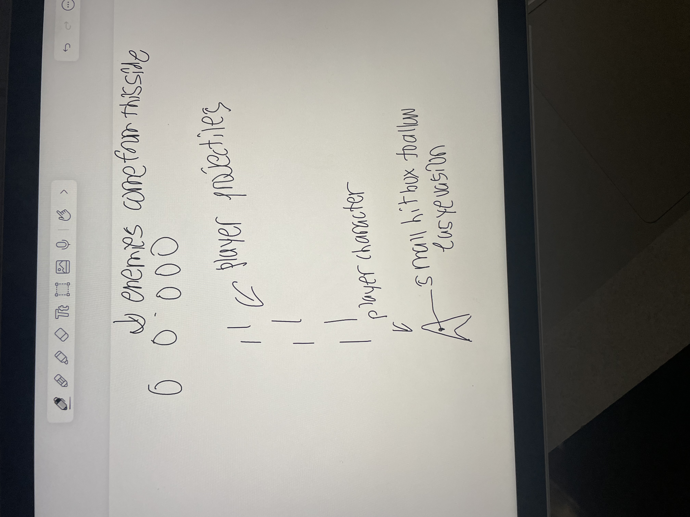

:warning: Everything between << >> needs to be replaced (remove << >> after replacing)

# << Project Title >>
## CS110 Final Project  << Semester, Year >>

## Team Members

 Marz 

***

## Project Description

a bullet hell style shooter inspired by the touhou franchise

***    

## GUI Design

### Initial Design

### Final Design

## Program Design

### Features

1. << Start menu >>
2. << Moveable character >>
3. << Player Projectiles >>
4. << Interactable enemy >>
5. << enemy projectiles >>

### Classes

- Player: Creates the player character, sets their movement options, sets their projectiles
- Enemy: sets the enemies, sets their position, sets their projectiles.

## ATP
Test Case 1: Player Movement
- Test Description: Verify the player character can move left, right, up, and down.
- Test Steps:
1. Start the Game
2. Press the W key and the Up key to make sure it can move up
3. Press the S key and the down key to make sure it can move down
4. Press the D key and the right key to make sure it can move right
5. Press the A key and the left key to make sure it can move left
- Expected Outcome: The player character should move in said directions with those inputs.

Test Case 2: Hitbox Detection
- Test Steps:
1. Start the Game
2. Collide with enemy projectile
3. Start the game up again 
4. Avoid enemy projectiles
- Expected Outcome: The projectiles should have proper collision with the player character

Test Case 3: Score Count
- Test Steps:
1. Start the Game
2. Avoid enemy projectiles to see if score goes up
3. Collide with enemy projectiles to see if the score stops
- Expected Outcome: Score should only continue while player is alive

Test Case 4: Retrying
- Test Steps:
1. Start the Game
2. Collide with projectile
3. Press Space bar to start again
- Expected Outcome: The game should run again

Test Case 5: Error Handeling
- Test Steps:
1. Start the Game
2. Enter invalid inputs while playing
3. Verify that the program does not crash and displays apprpriate error messages

Test Case 5: 
| Step                 |Procedure             |Expected Results                   |
|----------------------|:--------------------:|----------------------------------:|
|  1                   | Run Counter Program  |GUI window appears with count = 0  |
|  2                   | click count button   | display changes to count = 1      |
etc...
